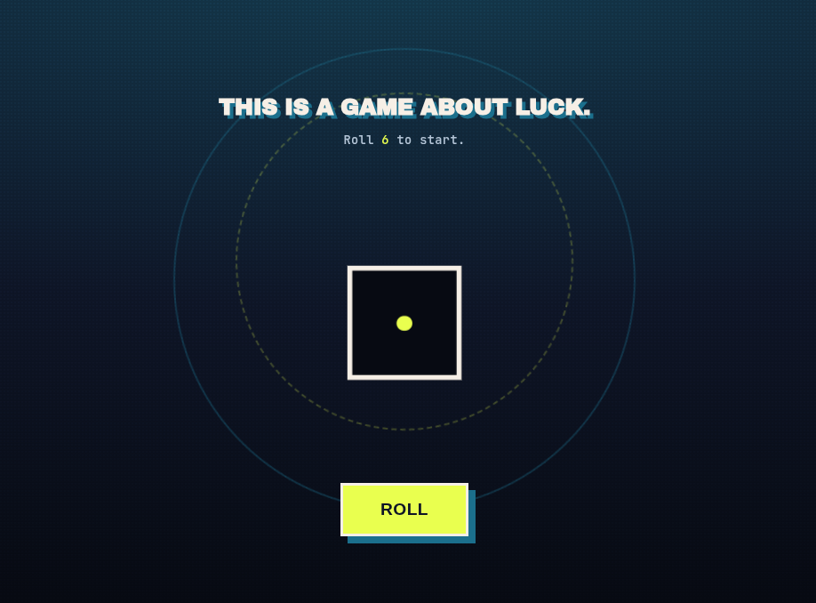
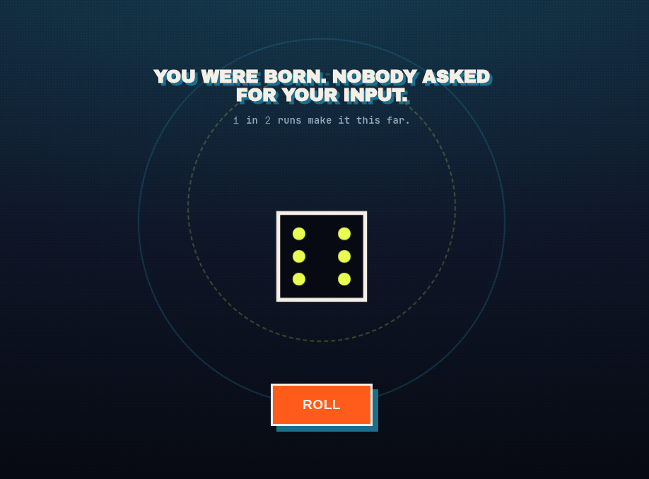
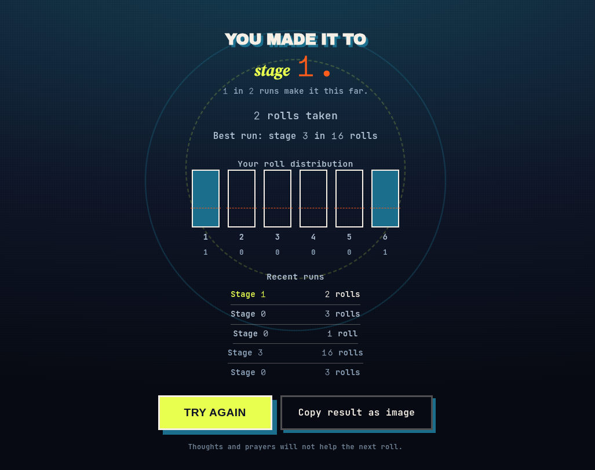

# Congratulations, Probably

A single-page game about luck. You roll a die: a 6 advances you to the next stage of an escalating, deadpan life story, and a 1 ends the run. Nothing else you do matters, because there are no choices and no skill, only the die.

Five selectable themes (Poster, Minimal, Maximalist, Terminal, Paper) change how it looks. None of them change the odds. On a phone you can also shake the device to roll.

**Live demo:** [congrats-probably.vercel.app](https://congrats-probably.vercel.app/)

<p>
  
  
  
</p>

## Why

Most games let you believe your choices mattered even when the system underneath is mostly random. Here the whole story of your run (job, house, kid, Mars) is gated behind a d6. It's a small joke about how much of what people credit to effort is variance, packaged as a game that's fun to sit with for thirty seconds.

## Stack

- React 19 + TypeScript + Vite
- Zustand for state
- Framer Motion for the die roll and stage transitions
- Canvas API for the shareable result card (no chart or image libraries)
- Plain CSS, no Tailwind
- No backend for the game: everything runs client-side and persists to `localStorage`
- One small Vercel function, `api/hit.js`, relays anonymous page-view counts to the owner's own collector. The game never waits on it. See [`docs/rules.md`](docs/rules.md)

## Local dev

```bash
npm install
npm run dev
```

## Build

```bash
npm run build
```

Outputs a static site in `dist/`, deployable as-is to Vercel, Netlify, or GitHub Pages.

## Project structure

```
src/
  content.ts             stage text (edit this to change the game's story)
  state/store.ts         zustand store: roll logic, stage/game-over transitions, persistence
  state/themeStore.ts    theme selection + persistence
  state/shakeSettingsStore.ts  shake sensitivity + persistence
  utils/rng.ts           die-roll RNG + outcome classification
  utils/canvasExport.ts  canvas rendering + clipboard/download for the share card
  components/
    Die.tsx              animated 3D die
    RollButton.tsx
    ShakeToRoll.tsx      shake-to-roll on mobile
    StageDisplay.tsx
    GameOverScreen.tsx
    Histogram.tsx        actual vs. expected roll distribution
    RunHistory.tsx       last 5 runs
    ShareCard.tsx        "copy result as image" button
    ThemePicker.tsx      theme switcher
    PosterBackdrop.tsx   decorative rings for the Poster theme
```

## Persistence

Stored in `localStorage` and nowhere else:
- Best run (furthest stage reached, tie-broken by fewest rolls)
- Recent runs (last 5)
- Lifetime roll count and distribution across all sessions
- Theme and shake sensitivity

Accounts, server sync and a leaderboard are out of scope on purpose.

## License

[MIT](LICENSE)
